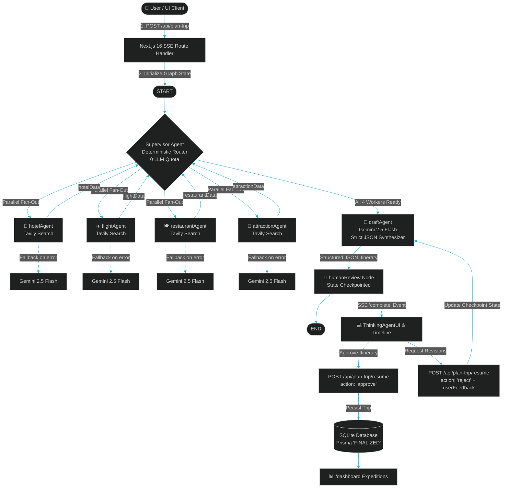

# Wanderlust AI: Architecture & Workflow Guide

> [!NOTE]
> This guide breaks down the technical architecture of the AI-powered travel planner, focusing heavily on the multi-agent orchestration using **LangGraph**, **Tavily Search**, **Google Gemini 2.5 Flash**, **Next.js 16 App Router**, and **Prisma SQLite**.

---

## High-Level Architecture

The application is built on a modern, robust stack:

- **Frontend**: Next.js 16 (App Router), React 19, Framer Motion for smooth micro-animations.
- **Styling**: Vanilla CSS with custom properties (`src/app/globals.css`)—no Tailwind, ensuring a bespoke, premium aesthetic (obsidian background, purple & teal gradients, glassmorphism).
- **Database**: SQLite, managed through Prisma ORM (`prisma/schema.prisma`).
- **Authentication**: NextAuth.js (Credentials Provider) with bcryptjs.
- **AI Orchestration**: `@langchain/langgraph` coupled with `@langchain/google-genai` and `@langchain/tavily` for live web search.

---

## LangGraph Multi-Agent Workflow

Instead of relying on a single massive LLM call, this application uses a **Multi-Agent System**. Various "specialist" agents run in parallel to gather data, which is then compiled by a "draft" agent, verified by a human, and finalized.

### 1. State Definition
LangGraph operates on a shared state. Our `TripState` defines the schema for this state, tracking user inputs (destination, budget, dates), gathered specialist data (`hotelData`, `flightData`, `restaurantData`, `attractionData`), and system routing status.

### 2. The Agent Nodes

#### The Supervisor (Router)
The `supervisorRouter` acts as a deterministic traffic controller. **To save API quota, it does not use an LLM.** Instead, it checks the state graph programmatically:
1. If research is missing, it routes to the 4 research agents **in parallel** by returning an array of their node names.
2. If research is complete but no itinerary exists, it routes to the `draftAgent`.
3. If the draft is ready, it routes to the `humanReview` node.

#### The Researchers (Parallel Execution)
Four specialized agents gather real-time data using the **Tavily Search API**. If Tavily is unavailable, they fall back to Gemini's internal knowledge. Running these in parallel drastically reduces the time required to plan a trip.
- `hotelAgent`: Finds accommodations fitting the budget.
- `flightAgent`: Estimates transport options and routes.
- `restaurantAgent`: Locates highly-rated local dining & culinary spots.
- `attractionAgent`: Curates landmarks, cultural activities, and sights based on user preferences.

#### The Draft Agent
Once all parallel research nodes complete and merge their data into the state, the `draftAgent` takes over. It feeds all the raw gathered research into Gemini (`gemini-2.5-flash`) and instructs it to output a strict, structured JSON schema representing the multi-day itinerary.

### 3. Human-In-The-Loop (HITL)
After drafting, the graph hits an END node mapped to `humanReview`.
1. The Next.js SSE API returns the current state (with the draft) to the frontend.
2. The UI presents the draft to the user with an interactive timeline.
3. If the user provides feedback (e.g., *"Include more seafood dining and add morning temple visits"*), the frontend calls the `/api/plan-trip/resume` endpoint with `action: 'reject'`.
4. The graph is resumed, the draft agent rewrites the itinerary incorporating the feedback, and returns the revised draft.
5. Once the user clicks **Approve**, the trip is stored in the local SQLite database via Prisma with status `FINALIZED`.

---

## Technical Workflow Diagram

---

## File Structure Reference

| Path | Purpose |
| :--- | :--- |
| [`src/lib/agent/tripPlannerGraph.ts`](file:///c:/Users/aruna/projects/new%20trip%20planner%20agent/src/lib/agent/tripPlannerGraph.ts) | LangGraph multi-agent orchestration, supervisor router, workers, and draft synthesis |
| [`src/lib/agent/tools.ts`](file:///c:/Users/aruna/projects/new%20trip%20planner%20agent/src/lib/agent/tools.ts) | Tavily search tool wrapper and formatting utilities |
| [`src/app/api/plan-trip/route.ts`](file:///c:/Users/aruna/projects/new%20trip%20planner%20agent/src/app/api/plan-trip/route.ts) | SSE streaming route handler for real-time agent execution telemetry |
| [`src/app/api/plan-trip/resume/route.ts`](file:///c:/Users/aruna/projects/new%20trip%20planner%20agent/src/app/api/plan-trip/resume/route.ts) | HITL resume endpoint for approvals (Prisma SQLite save) and feedback revisions |
| [`src/components/ThinkingAgentUI.tsx`](file:///c:/Users/aruna/projects/new%20trip%20planner%20agent/src/components/ThinkingAgentUI.tsx) | Live terminal command center, agent telemetry badges, draft overview, and review input |
| [`src/components/Timeline.tsx`](file:///c:/Users/aruna/projects/new%20trip%20planner%20agent/src/components/Timeline.tsx) | Interactive vertical multi-day itinerary timeline with Framer Motion animations |
| [`src/app/plan-trip/page.tsx`](file:///c:/Users/aruna/projects/new%20trip%20planner%20agent/src/app/plan-trip/page.tsx) | 3-step wizard (Destinations $\rightarrow$ Budget/Dates $\rightarrow$ Preferences) |
| [`src/app/dashboard/page.tsx`](file:///c:/Users/aruna/projects/new%20trip%20planner%20agent/src/app/dashboard/page.tsx) | User expeditions dashboard with saved trips, statistics, and full itinerary viewer |
| [`prisma/schema.prisma`](file:///c:/Users/aruna/projects/new%20trip%20planner%20agent/prisma/schema.prisma) | SQLite database schema with `User` and `Trip` models |
