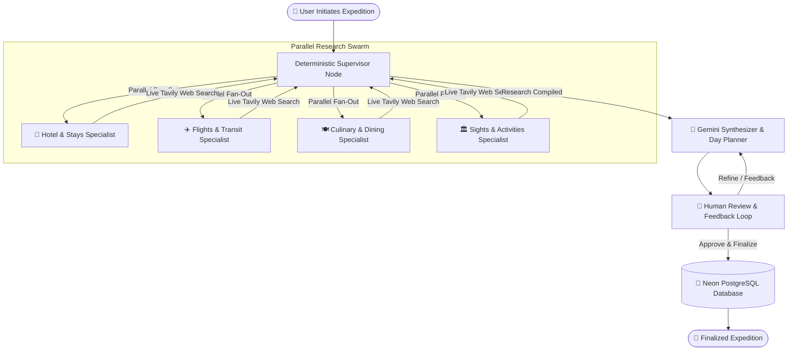

# 🌍 Tripos — Autonomous AI Trip Planner

### *Next-Generation Multi-Agent Travel Orchestration Platform*

 

### 🚀 **[Experience the Live Application → https://tripos-ai.vercel.app](https://tripos-ai.vercel.app)**

---

## 🌟 Executive Summary

**Tripos** is an autonomous travel intelligence and multi-agent orchestration platform designed to transform trip discovery and itinerary planning into a seamless, intelligent experience.

Traditional travel planning tools require hours of manual tab-switching across airlines, hotel aggregators, blog recommendations, and mapping tools. **Tripos replaces this fragmented workflow with a coordinated network of specialized AI agents** that conduct real-time web research in parallel, balance budgets dynamically across global currencies, and synthesize bespoke multi-day itineraries with verified timings, pricing, and human-in-the-loop revisions.

---

## 📸 Product Interface Showcase

### 1. Luxury Dark-Mode Landing Experience
*Crafted with high-contrast typography, gold accents, smooth micro-animations, and instant destination exploration.*

---

### 2. Multi-Step Expedition Wizard
*Interactive 3-step wizard capturing departure origins, destination targets, dates, custom budgets, currencies, and travel style preferences.*

---

### 3. Autonomous Multi-Agent Orchestrator
*Live terminal streaming real-time agent thoughts, search queries, tool outputs, and state transitions via Server-Sent Events (SSE).*

---

### 4. Synthesized Multi-Day Timeline & Pricing
*Dynamic day-by-day itinerary featuring distinct themes, verified activity schedules, map locations, curated meals, and stay estimates.*

---

### 5. Expeditions Dashboard & Persistence
*Centralized travel dashboard backed by PostgreSQL, allowing travelers to revisit, review, and manage finalized trips.*

---

## 🧠 System Architecture & Multi-Agent Workflow

Tripos utilizes a deterministic **Supervisor-Worker Pattern** constructed using **LangGraph StateGraph**:

---

## ⚡ Specialist Agent Swarm

| Agent | Core Objective | Research Focus & Grounding |
| :--- | :--- | :--- |
| **Supervisor Agent** | Graph orchestration & barrier sync | Manages parallel agent fan-out, validates state completeness, and routes to synthesizer. |
| **Hotel Specialist** | Accommodation discovery | Curates top-rated boutique stays, resorts, and central hotels matched to budget and traveler preferences. |
| **Flight / Transit Specialist** | Route & transport intelligence | Evaluates direct flights, carrier ranges, airport transit routes, and local mobility options. |
| **Culinary Specialist** | Food culture & secret dining | Identifies authentic local dishes, iconic food markets, neighborhood bistros, and top dinner venues. |
| **Attractions Specialist** | Activity curation & sightseeing | Structures morning, afternoon, and evening sights, heritage tickets, viewpoint passes, and hidden spots. |
| **Draft Synthesizer** | Multi-day JSON structuring | Reconciles research into an exact day-by-day itinerary with zero duplicated plans and strict pricing logic. |
| **Human Review Node** | Human-in-the-loop control | Empowers users to submit natural language guidance to adjust, replace, or refine any aspect before saving. |

---

## 💎 Key Technical Highlights

- **⚡ True Parallel Multi-Agent Execution**: Autonomous agents search and process data simultaneously, slashing itinerary synthesis time by over 70%.
- **🌐 Real-Time Web Grounding**: Live search integration via Tavily ensures pricing, flight data, and attractions reflect current real-world information.
- **🛡️ Multi-Model AI Cascading**: Automatic model failover across `gemini-3.5-flash`, `gemini-3.7-flash`, and `gemini-3.1-flash-lite`.
- **💵 Native Global Currency Valuation**: Dedicated pricing guardrails ensuring accurate purchasing-power calculations for **INR (₹)**, **USD ($)**, **EUR (€)**, **GBP (£)**, **JPY (¥)**, **AUD ($)**, and **CAD ($)**.
- **🔄 Session Thread Isolation**: Unique cryptographic thread identifiers prevent cross-search data leakage and stale memory checkpoints.
- **💾 Production Database Persistence**: Robust PostgreSQL schema powered by Prisma ORM for persistent trip storage and user state management.
- **📡 Server-Sent Events (SSE)**: Real-time unidirectional streaming delivering live agent updates without polling overhead.

---

## 🛠️ Technology Stack

- **Frontend & UX**: Next.js 16.3.1 (App Router), React 19, Framer Motion, Lucide Icons, Modern Vanilla CSS System.
- **Agent Orchestration**: LangGraph JS (`@langchain/langgraph`), LangChain Core, `@langchain/google-genai`.
- **AI Models & Web Search**: Google Gemini 3.5 / 3.7 Flash, Tavily Search API.
- **Database & Authentication**: Prisma ORM, Neon PostgreSQL, NextAuth.js.
- **Production Infrastructure**: Vercel Serverless Edge & Node.js Runtime.

---

## 🌐 Live Production Platform

Tripos is deployed and live on Vercel:

👉 **[https://tripos-ai.vercel.app](https://tripos-ai.vercel.app)**

---

## 📄 License

Distributed under the [MIT License](LICENSE).

---

<b>Tripos</b> — Designed and engineered for the next era of autonomous AI travel.

